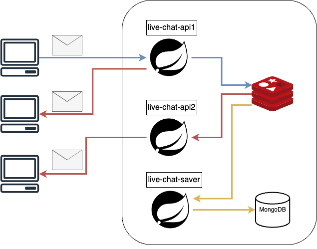

# live-chat-api

Redis와 WebSocket을 이용한 라이브 채팅 API

# 아키텍처



* 웹소켓을 이용하여 클라이언트와 실시간 통신
* 레디스 Pub/Sub 을 이용하여 여러 live-chat-api 에 접속한 클라이언트에게 메시지 전송
* 레디스에 저장된 메시지를 live-chat-saver 에서 몽고디비로 저장

# 명세
## API 명세

서버 실행 후 http://localhost:8080/swagger-ui/index.html#/ 에서 확인 가능합니다.

## WebSocket 명세

[WebSocket STOMP 명세](https://github.com/hyper-web-space/live-chat-server/wiki/WebSocket-STOMP-%EB%AA%85%EC%84%B8) 에서 확인할 수 있습니다.

# 멀티 모듈

이 프로젝트는 멀티 모듈로 구성되어 있습니다.

## live-chat-api

클라이언트와 통신하는 API 서버입니다.

* rest api 를 통해 기본적인 인증과 채팅 관련 데이터를 전송합니다.

* 웹소켓을 사용하여 클라이어트와 실시간 통신을 하여 메시지를 전송합니다.

* Redis Pub/Sub 을 사용하여 여러 live-chat-api 와 live-chat-saver 에 메시지를 공유합니다.

## live-chat-saver

메시지를 저장하는 서버입니다.

* Redis Sub 으로 메시지를 전달받아 몽고 디비에 저장합니다.

## live-chat-message

메시지를 공통으로 사용하는 모듈입니다.

* live-chat-api 와 live-chat-saver 에서 사용하며 전송되는 메시지 관련 클래스들을 포함합니다.


# 빌드

## gradle
### live-chat-api
```shell
$ ./gradlew :live-chat-api:bootJar
```

### live-chat-saver
```shell
$ ./gradlew :live-chat-saver:bootJar
```

## 도커 빌드 및 이미지 생성
### live-chat-api
```shell
$ make docker-build-api
```

### live-chat-saver
```shell
$ make docker-build-saver
```

# 실행
## jar 파일로 실행
### live-chat-api
```shell
$ java -jar live-chat-api/build/libs/live-chat-api.jar
```

### live-chat-saver
```shell
$ java -jar live-chat-saver/build/libs/live-chat-saver.jar
```

## docker-compose 로 실행

```shell
$ docker-compose up -d
```

### docker-compose.yaml 예시

```yaml
version: "3.9"

services:
  api:
    image: ghcr.io/hyper-web-space/live-chat-api:latest
    restart: always
    ports:
      - "8080:8080"
    environment:
      MONGODB_HOST: mongo
      MONGODB_USERNAME: root
      MONGODB_PASSWORD: root
      REDIS_HOST: redis
      REDIS_PORT: 6379
    depends_on:
      - mongo
      - redis
  saver:
    image: ghcr.io/hyper-web-space/live-chat-saver:latest
    restart: always
    ports:
      - "9090:9090"
    environment:
      MONGODB_HOST: mongo
      MONGODB_USERNAME: root
      MONGODB_PASSWORD: root
      REDIS_HOST: redis
      REDIS_PORT: 6379
    depends_on:
      - api
  mongo:
    image: mongo
    restart: always
    ports:
      - "27017:27017"
    environment:
      MONGO_INITDB_ROOT_USERNAME: root
      MONGO_INITDB_ROOT_PASSWORD: root
    volumes:
      - ./mongo-data:/data/db
  redis:
    restart: always
    image: redis:latest
    ports:
      - "6379:6379"

```
